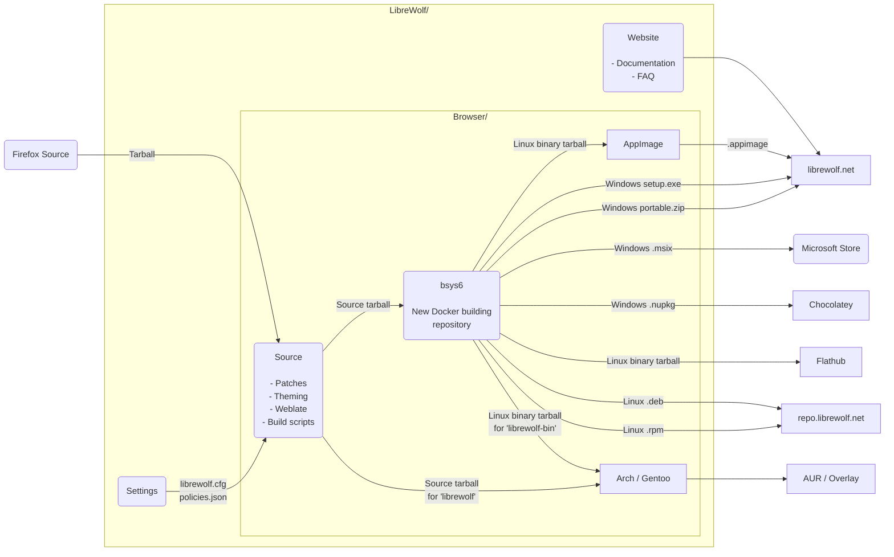

<div align="center">


# LibreWolf

This repository contains all the patches and theming that make up LibreWolf,
as well as scripts and a Makefile to build LibreWolf.
There is also the [Settings repository](https://codeberg.org/librewolf/settings),
which contains the LibreWolf preferences.

</div>

## Infra

### Overview



### Packages

These are the locations where people have their repositories and build artifacts.

Active:

- [Arch](https://codeberg.org/librewolf/arch) - Arch Linux package
- [BSYS6](https://codeberg.org/librewolf/bsys6) - Linux Mint, Fedora,
  Ubuntu, MacOS, portable and setup for Windows
- [Gentoo](https://codeberg.org/librewolf/gentoo) - Gentoo GNU/Linux package

Downstream:

- [Alpine Linux](https://pkgs.alpinelinux.org/packages?name=librewolf&arch=)

### Forks

Previous:

- [CachyOS Browser](https://github.com/cachyos/cachyos-browser-settings)
- [FireDragon Browser](https://github.com/dr460nf1r3/firedragon-browser)

## Build

There are two ways to build LibreWolf.
You can either use the source tarball
or compile directly with this repository.

### Build: Tarball

1. Let's **[download the latest tarball](https://codeberg.org/librewolf/source/releases)**.
   This tarball is the latest produced by the [CI](https://codeberg.org/librewolf/source/actions?workflow=source-release.yaml).
   You can also check the `sha256sum` of the tarball there:

   ```bash
   tar xf <tarball>
   cd <folder>
   ```

2. Then, you have to bootstrap your system to be able to build LibreWolf.
   You only have to do this one time.
   It is done by running the following command:

   ```bash
   ./mach --no-interactive bootstrap --application-choice=browser
   ```

3. Build LibreWolf and then package or run it with the following commands:

   ```bash
   ./mach build && ./mach package
   # or
   ./mach build && ./mach run
   ```

   > [!NOTE]
   >
   > To get all parameters of `./mach`, use:
   >
   > ```bash
   > ./mach configure -- --help | less
   > ```

### Build: Repository

1. Clone this repository with Git:

   ```bash
   git clone --recursive git@codeberg.org:librewolf/source.git librewolf-source --depth=1 && cd librewolf-source
   ```

2. Build LibreWolf source code,
   also you have to bootstrap your system to be able to build LibreWolf.
   You only have to do this one time.

   ```bash
   make dir && make bootstrap
   ```

3. Package LibreWolf or run it with the following commands:

   ```bash
   make build && make package
   # or
   make build && make run
   ```

## Translations

We use Weblate to localize all LibreWolf-specific strings.
You can help us by translating LibreWolf into your language at
<https://translate.codeberg.org/engage/librewolf>.
Here is the current translation status:

<a href="https://translate.codeberg.org/engage/librewolf/">
  
</a>

## Development

### Development: Creating a patch

The easiest way to make patches is to go to the LibreWolf source folder:

```bash
cd librewolf-$(cat version)
git init
git add <path_to_file_you_changed>
git commit -am initial-commit
git diff > ../mypatch.patch
```

We have Gitter / Matrix rooms,
and on the website we have links to the various issue trackers.

### Development: Existing patches

The easiest way to make patches is to go to the LibreWolf source folder:

```bash
make fetch
./scripts/git-patchtree.sh patches/sed-patches/disable-pocket.patch
```

Now change the source tree the way you want,
keeping in mind to `git add` new files.
When done, you can create the new patch with:

```bash
cd firefox-<version>
git diff 4b825dc642cb6eb9a060e54bf8d69288fbee4904 HEAD > ../my-patch-name.patch
```

This ID is the hash value of the first commit, which is called `initial`.
Don't forget to commit changes before doing this diff,
or the patch will be incomplete.

### Development: Creating a patch for problems in Mozilla's [Bugzilla](https://bugzilla.mozilla.org)

Well, first of all:

- [Create an account](https://bugzilla.mozilla.org/createaccount.cgi).
- Handy link: [Bugs Filed Today](https://bugzilla.mozilla.org/buglist.cgi?cmdtype=dorem&remaction=run&namedcmd=Bugs%20Filed%20Today&sharer_id=1&list_id=15939480).
- The essential: [Firefox Source Tree Documentation](https://firefox-source-docs.mozilla.org/).

Now that you have a patch in LibreWolf, that's not enough to upload to Mozilla.
See, Mozilla only accepts patches against Nightly.
So here is how to do that:

1. If you have not done so already,
   create the `mozilla-unified` folder and build Firefox with it:

   ```bash
   hg clone https://hg.mozilla.org/mozilla-unified && cd mozilla-unified
   hg update
   MOZBUILD_STATE_PATH=$HOME/.mozbuild ./mach --no-interactive bootstrap --application-choice=browser
   ./mach build
   ./mach run
   ```

2. If you skipped the previous step, you could ensure that you're up to date with:

   ```bash
   cd mozilla-unified
   hg pull && hg update
   ```

3. Now you can apply your patch to Nightly:

   ```bash
   patch -p1 -i ../mypatch.patch
   ```

4. Now, let Mercurial create the patch:

   ```bash
   hg diff > ../my-nightly-patch.patch
   ```

5. After this, it can be uploaded to Bugzilla.

#### Development: Contributing

Time to start hacking! You should join us on [Matrix](https://chat.mozilla.org),
say hello in the [Introduction channel](https://chat.mozilla.org/#/room/#introduction:mozilla.org),
and [find a bug to start working on](https://codetribute.mozilla.org).
See the [Firefox Contributors' Quick Reference](https://firefox-source-docs.mozilla.org/contributing/contribution_quickref.html#firefox-contributors-quick-reference)
to learn how to test your changes,
send patches to Mozilla,
update your source code locally, and more.

## MacOS and Windows

We understand, life isn't always fair 😺.
The same steps as above apply you will just have to walk through
the beginning part of the guides for:

- [MacOS](https://firefox-source-docs.mozilla.org/setup/macos_build.html):
  The cross-compiled Mac `.dmg` files are somewhat new.
  They should work, perhaps with the exception of the `make setup-wasi` step.
- [Windows](https://firefox-source-docs.mozilla.org/setup/windows_build.html):
  Building on Windows is not very well tested.

Help with testing these targets is always welcome.
